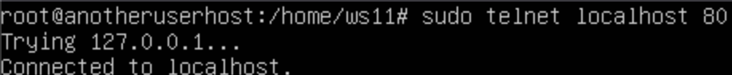

## Part 1. Инструмент ipcalc
**== Выполнение ==**

### 1.1. Сети и маски

#### Определи и запиши в отчет:
1) Адрес сети 192.167.38.54/13

2) Перевод маски 255.255.255.0 в префиксную и двоичную запись, /15 в обычную и двоичную, 11111111.11111111.11111111.11110000 в обычную и префиксную
   
    В красном квадрате префиксная запись, двоичная справа

`ipcalc /15`


    У числа 11111111.11111111.11111111.11110000 префиксная запись /28

3) Минимальный и максимальный хост в сети 12.167.38.4 при масках: /8, 11111111.11111111.00000000.00000000, 255.255.254.0 и /4


### 1.2. localhost

#### Определи и запиши в отчёт, можно ли обратиться к приложению, работающему на localhost, со следующими IP: 194.34.23.100, 127.0.0.2, 127.1.0.1, 128.0.0.1

Для определения доступности приложения, работающего на `localhost` нужно учитывать, что `localhost` обычно сопоставляется с сетевым интерфейсом `loopback`, который находится в диапазоне IP-адресов 127.0.0.0/8
1) 194.34.23.100: IP-адрес не принадлежит необходимому диапазону, поэтому обратиться к нему нельзя
2) 127.0.0.2: IP-адрес принадлежит диапазону, обратиться можно
3) 127.1.0.1: IP-адрес принадлежит диапазону, обратиться можно
4) 128.0.0.1: IP-адрес не принадлежит необходимому диапазону, поэтому обратиться к нему нельзя

### 1.3. Диапазоны и сегменты сетей

#### Определи и запиши в отчёт:

1) Какие из перечисленных IP можно использовать в качестве публичного, а какие только в качестве частных: 10.0.0.45, 134.43.0.2, 192.168.4.2, 172.20.250.4, 172.0.2.1, 192.172.0.1, 172.68.0.2, 172.16.255.255, 10.10.10.10, 192.169.168.1
  

   Для определения, можно ли использовать перечисленные IP-адреса в качестве публичных или частных, мы должны применить стандарты и соглашения, определенные в спецификации IP-адресации.

   К частным IP адресам относятся диапазоны:
   
   - 10.0.0.0 — 10.255.255.255
   - 100.64.0.0 — 100.127.255.255
   - 172.16.0.0 — 172.31.255.255
   - 192.168.0.0 — 192.168.255.255
 
   Публичные адреса:
   - 134.43.0.2
   - 172.0.2.1
   - 192.172.0.1
   - 172.68.0.2
   - 192.169.168.1

   Частные адреса:
   - 10.0.0.45
   - 192.168.4.2
   - 172.20.250.4
   - 172.16.255.255
   - 10.10.10.10

2) Какие из перечисленных IP адресов шлюза возможны у сети 10.10.0.0/18: 10.0.0.1, 10.10.0.2, 10.10.10.10, 10.10.100.1, 10.10.1.255

   Для определения возможных IP-адресов шлюза в сети 10.10.0.0/18 мы должны учитывать следующие факты:

   * Шлюз (или шлюз по умолчанию) - это узел в сети TCP/IP, который используется для маршрутизации трафика из одной сети в другую. Шлюз обычно является первым узлом в сети, через который проходит трафик к внешним сетям.

   * Адрес шлюза должен находиться в той же подсети, что и устройства в этой сети.
   
   Найдем диапазон возможных адресов:


   Таким образом, возможными IP-адресами шлюза для сети 10.10.0.0/18 являются 10.10.0.2 и 10.10.10.10
## Part 2. Статическая маршрутизация между двумя машинами
**== Выполнение ==**

#### Подними две виртуальные машины
#### С помощью команды ip a посмотри существующие сетевые интерфейсы.


#### Опиши сетевой интерфейс, соответствующий внутренней сети, на обеих машинах и задать следующие адреса и маски: ws1 - 192.168.100.10, маска /16, ws2 - 172.24.116.8, маска /12.


#### Выполни команду `netplan apply` для перезапуска сервиса сети.


### 2.1. Добавление статического маршрута вручную

#### Добавь статический маршрут от одной машины до другой и обратно при помощи команды вида `ip r add`.
#### Пропингуй соединение между машинами.


### 2.2. Добавление статического маршрута с сохранением

#### Перезапусти машины.
#### Добавь статический маршрут от одной машины до другой с помощью файла etc/netplan/00-installer-config.yaml.


#### Пропингуй соединение между машинами.


## Part 3. Утилита iperf3
**== Выполнение ==**

### 3.1 Скорость соединения

#### Переведи и запиши в отчёт: 8 Mbps в MB/s, 100 MB/s в Kbps, 1 Gbps в Mbps.
```
8 Mbps = 1 MB/s
100 MB/s = 800000 Kbps
1 Gbps = 1000 Mbps
```
### 3.2. Утилита iperf3

#### Измерь скорость соединения между ws1 и ws2.


## Part 4. Сетевой экран
**== Выполнение ==**

### 4.1. Утилита iptables

#### Создай файл `/etc/firewall.sh`, имитирующий фаерволл, на ws1 и ws2:


#### Запусти файлы на обеих машинах командами `chmod +x /etc/firewall.sh` и `/etc/firewall.sh`.


### 4.2. Утилита nmap

#### Командой `ping` найди машину, которая не «пингуется»


#### после чего утилитой `nmap` покажи, что хост машины запущен.


## Part 5. Статическая маршрутизация сети
**== Выполнение ==**

#### Подними пять виртуальных машин (3 рабочие станции (ws11, ws21, ws22) и 2 роутера (r1, r2)).

### 5.1. Настройка адресов машин

#### Настрой конфигурации машин в `etc/netplan/00-installer-config.yaml` согласно сети на рисунке.


#### Перезапусти сервис сети. Если ошибок нет, то командой `ip -4 a` проверь, что адрес машины задан верно. Также пропингуй ws22 с ws21. Аналогично пропингуй r1 с ws11.


### 5.2. Включение переадресации IP-адресов

#### Для включения переадресации IP, выполни команду на роутерах:
#### `sysctl -w net.ipv4.ip_forward=1`
#### При таком подходе переадресация не будет работать после перезагрузки системы.


#### Открой файл `/etc/sysctl.conf` и добавь в него следующую строку:


### 5.3. Установка маршрута по-умолчанию

#### Настрой маршрут по-умолчанию (шлюз) для рабочих станций. Для этого добавь default перед IP роутера в файле конфигураций.


#### Вызови `ip r` и покажи, что добавился маршрут в таблицу маршрутизации.


#### Пропингуй с ws11 роутер r2 и покажи на r2, что пинг доходит. Для этого используй команду: `tcpdump -tn -i eth0`


### 5.4. Добавление статических маршрутов

#### Добавь в роутеры r1 и r2 статические маршруты в файле конфигураций.


#### Вызови `ip r` и покажи таблицы с маршрутами на обоих роутерах.


#### Для адреса 10.10.0.0/18 был выбран маршрут, отличный от 0.0.0.0/0, т.к. при наличии нескольких маршрутов одинаковой длины выбирается наиболее точно заданный.

### 5.5. Построение списка маршрутизаторов

#### Запусти на r1 команду дампа: `tcpdump -tnv -i eth0`

#### При помощи утилиты traceroute построй список маршрутизаторов на пути от ws11 до ws21.


#### Traceroute отправляет пакеты с изменяющимся TTL к целевому хосту. Каждый промежуточный маршрутизатор на пути отвечает ICMP сообщением о времени истечения TTL, позволяя определить IP-адрес и время прохождения каждого узла.

### 5.6. Использование протокола ICMP при маршрутизации

#### Запусти на r1 перехват сетевого трафика, проходящего через eth0 с помощью команды: `tcpdump -n -i eth0 icmp`


#### Пропингуй с ws11 несуществующий IP (например, 10.30.0.111)


## Part 6. Динамическая настройка IP с помощью DHCP
**== Выполнение ==**

#### Для r2 настрой в файле /etc/dhcp/dhcpd.conf конфигурацию службы DHCP:


#### В файле resolv.conf пропиши `nameserver 8.8.8.8`.


#### Перезагрузи службу DHCP командой systemctl restart isc-dhcp-server. Машину ws21 перезагрузи при помощи reboot и через ip a покажи, что она получила адрес. Также пропингуй ws22 с ws21.


#### Укажи MAC адрес у ws11, для этого в etc/netplan/00-installer-config.yaml надо добавить строки: `macaddress: 10:10:10:10:10:BA`, `dhcp4: true`.


#### Для r1 настрой аналогично r2, но сделай выдачу адресов с жесткой привязкой к MAC-адресу (ws11). Проведи аналогичные тесты.

#### Изменю конфигурацию файла /etc/dhcp/dhcpd.conf

#### Изменю конфигурацию файла /etc/resolv.conf

#### Перезагружу службу DHCP

#### `ip a` на ws11


#### Запроси с ws21 обновление ip адреса.


## Part 7. NAT
**== Выполнение ==**

#### В файле /etc/apache2/ports.conf на ws22 и r1 измени строку Listen 80 на Listen 0.0.0.0:80, то есть сделай сервер Apache2 общедоступным.


#### Добавь в фаервол, созданный по аналогии с фаерволом из Части 4, на r2 следующие правила:

1) Удаление правил в таблице filter - `iptables -F`;

2) Удаление правил в таблице "NAT" - `iptables -F -t nat`;

3) Отбрасывать все маршрутизируемые пакеты - `iptables --policy FORWARD DROP`.

4) Разрешить маршрутизацию всех пакетов протокола ICMP.


#### Проверь соединение между ws22 и r1 командой `ping`.


#### Добавь в файл ещё два правила:

5) Включи SNAT, а именно маскирование всех локальных ip из локальной сети, находящейся за r2 (по обозначениям из Части 5 - сеть 10.20.0.0).

6) Включи DNAT на 8080 порт машины r2 и добавить к веб-серверу Apache, запущенному на ws22, доступ извне сети.


#### Проверь соединение по TCP для DNAT: для этого с r1 подключиться к серверу Apache на ws22 командой `telnet` (обращаться по адресу r2 и порту 8080).


## Part 8. Дополнительно. Знакомство с SSH Tunnels
**== Выполнение ==**

#### Запусти на r2 фаервол с правилами из Части 7.
#### Запусти веб-сервер Apache на ws22 только на localhost (то есть в файле /etc/apache2/ports.conf измени строку `Listen 80` на `Listen localhost:80`).


#### Воспользуйся Local TCP forwarding с ws21 до ws22, чтобы получить доступ к веб-серверу на ws22 с ws21.
#### Воспользуйся Remote TCP forwarding c ws11 до ws22, чтобы получить доступ к веб-серверу на ws22 с ws11.
#### Для проверки, сработало ли подключение в обоих предыдущих пунктах, перейди во второй терминал (например, клавишами Alt + F2) и выполни команду: `telnet 127.0.0.1 [локальный порт]`

